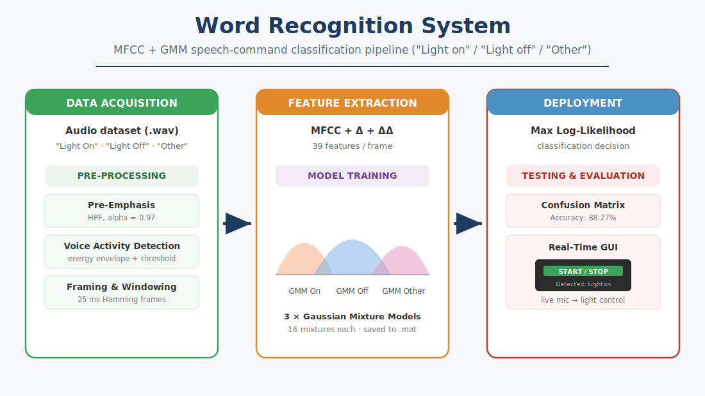
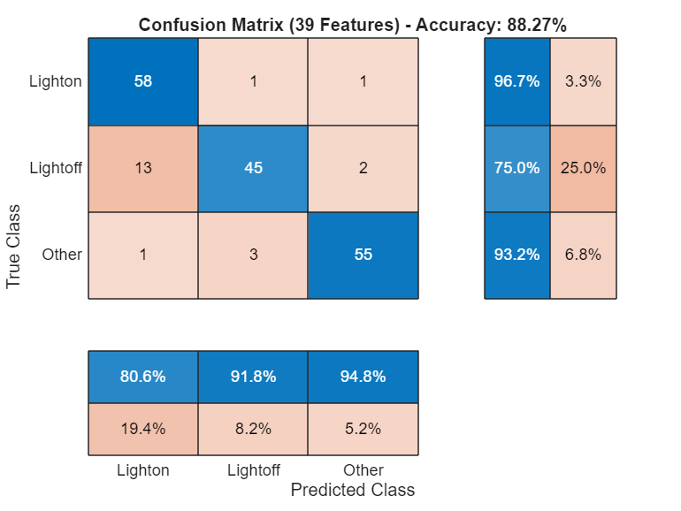

# Word Recognition System (MFCC + GMM)

A speech-command recognition system built in MATLAB that classifies short audio
clips into three categories — **"Light On"**, **"Light Off"**, and **"Other"** —
and drives a simulated light through a real-time GUI. Developed as a project for
an Advanced DSP course.



## Overview

The system follows a classic speech-recognition pipeline: each recording is
pre-processed, converted into **Mel-Frequency Cepstral Coefficients (MFCCs)**,
and classified with **Gaussian Mixture Models (GMMs)** using a maximum
log-likelihood decision rule.

**Pipeline stages**

1. **Pre-Processing** — Pre-Emphasis (first-order high-pass filter, `alpha = 0.97`),
   Voice Activity Detection (VAD) to isolate speech from silence/noise, and
   Hamming windowing of ~25 ms frames.
2. **Feature Extraction** — 13 MFCCs expanded to **39 features per frame** by
   appending Delta and Delta-Delta (velocity and acceleration) coefficients.
3. **Model Training** — one GMM per class (16 mixtures each), saved to a `.mat`
   file for deployment.
4. **Deployment** — a real-time App Designer GUI records from the microphone,
   runs the same pipeline, and turns a virtual light on/off based on the
   recognised command, with a confidence gauge and system log.

## Results

The system reaches an overall accuracy of **88.27%** on a balanced test set
(60 samples per class). "Light On" and "Other" classify strongly; "Light Off"
is the most challenging class.



| Class      | Recall  |
|------------|---------|
| Light On   | 96.7%   |
| Light Off  | 75.0%   |
| Other      | 93.2%   |

## Repository Structure

```
.
├── README.md
├── docs/
│   ├── Word_Recognition_Report.docx   # Full project report
│   └── images/                        # Diagrams and result figures
├── models/
│   └── trained_gmm_models.mat         # Pre-trained GMMs (gmmOn, gmmOff, gmmOther)
└── src/
    ├── word_recognition_pipeline.m    # Stage-by-stage analysis + figures
    ├── train_gmm_models.m             # Trains and saves the three GMMs
    ├── test_gmm_models.m              # Evaluation + confusion matrix
    ├── WordRecognitionApp.m           # Real-time GUI (App Designer class)
    └── Word_Recognition_Final.mlx     # MATLAB Live Script (full pipeline)
```

## Requirements

- MATLAB (R2020b or newer recommended)
- Signal Processing Toolbox
- Audio Toolbox (provides `mfcc`)
- Statistics and Machine Learning Toolbox (provides `fitgmdist`)

## Usage

1. **Prepare the dataset.** Place `.wav` files under:
   ```
   Data/Train/{Lighton, Lightoff, Other}/
   Data/Test/{Lighton, Lightoff, Other}/
   ```
   (The dataset is not included in this repository.)

2. **Explore the pipeline** (optional) — run `src/word_recognition_pipeline.m`
   to reproduce the pre-emphasis, VAD, windowing, spectrogram and MFCC figures.

3. **Train the models:**
   ```matlab
   run('src/train_gmm_models.m')
   ```
   This writes `models/trained_gmm_models.mat`.

4. **Evaluate:**
   ```matlab
   run('src/test_gmm_models.m')
   ```
   Prints overall accuracy and plots the confusion matrix.

5. **Run the real-time GUI:**
   ```matlab
   WordRecognitionApp
   ```
   Press **START**, speak a command, and watch the light and confidence gauge
   respond. A pre-trained model is included, so you can run the GUI without
   retraining. `WordRecognitionApp.m` is a plain-text class you can run
   directly, or open in App Designer to edit the layout visually.

## How It Works

Each GMM models the probability distribution of the 39-dimensional MFCC feature
vectors for one class. At inference time, the feature frames of an unknown clip
are scored under all three models; the class whose model yields the highest total
log-likelihood wins. The GUI additionally converts the three scores into a
softmax confidence percentage for display.

## License

Released under the MIT License — see [LICENSE](LICENSE).
